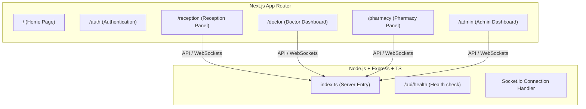

# Graph Report - MedflowX Initialization

This report tracks the components and code symbols added during the project initialization.

## System Graph Overview

## Initialized Folders & Files

### Frontend
- `/frontend`
  - `/src/app/layout.tsx` - Root layout
  - `/src/app/page.tsx` - App home page
  - `/src/app/globals.css` - Global CSS with Tailwind CSS v4 directives
  - `/src/app/auth/page.tsx` - Auth module placeholder
  - `/src/app/reception/page.tsx` - Reception module placeholder
  - `/src/app/doctor/page.tsx` - Doctor module placeholder
  - `/src/app/pharmacy/page.tsx` - Pharmacy module placeholder
  - `/src/app/admin/page.tsx` - Admin module placeholder

### Backend
- `/backend`
  - `/src/index.ts` - Setup Express, Socket.io, middleware, and `/api/health`
  - `/package.json` - Backend dependency configuration
  - `/tsconfig.json` - Backend TypeScript compiler options
  - `/.env` - Backend environment settings
