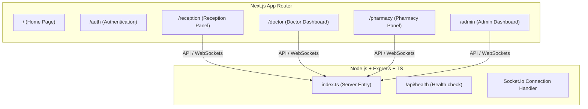

# Graph Report - MedflowX Initialization

This report tracks the components and code symbols added during the project initialization.

## System Graph Overview

## Initialized Folders & Files

### Frontend
- `/frontend`
  - `/src/app/layout.tsx` - Root layout
  - `/src/app/page.tsx` - App home page
  - `/src/app/globals.css` - Global CSS with Tailwind CSS v4 directives
  - `/src/app/auth/page.tsx` - Auth module placeholder
  - `/src/app/reception/page.tsx` - Reception module placeholder
  - `/src/app/doctor/page.tsx` - Doctor module placeholder
  - `/src/app/pharmacy/page.tsx` - Completed Pharmacist Workspace UI (queue lookup, checkout, stock controls, socket connection)
  - `/src/app/admin/page.tsx` - Admin module placeholder

### Backend
- `/backend`
  - `/src/index.ts` - Setup Express, Socket.io, middleware, health check, and registered pharmacy routes
  - `/src/supabase.ts` - Supabase service role client connection helper
  - `/src/routes/pharmacy.ts` - Pharmacy business logic and endpoints (inventory, stock batch add, queue query, checkout FIFO logic)
  - `/package.json` - Backend dependency configuration
  - `/tsconfig.json` - Backend TypeScript compiler options
  - `/.env` - Backend environment settings

## Recent Fixes & Adjustments
- **Supabase Client Initialization**: Safe guards added in [supabaseClient.ts](file:///c:/Users/phani/Desktop/office-files/medical-tracker-trueupmedia/frontend/src/lib/supabaseClient.ts) to check configurations before calling `createClient`, preventing top-level crashes when environment variables are unset.
- **Supabase Null Client Fix**: Added Proxy-based safeguards in [supabaseClient.ts](file:///c:/Users/phani/Desktop/office-files/medical-tracker-trueupmedia/frontend/src/lib/supabaseClient.ts) and [supabase.ts](file:///c:/Users/phani/Desktop/office-files/medical-tracker-trueupmedia/frontend/src/lib/supabase.ts) to throw descriptive errors when Supabase environment variables are missing. This allows the reception panel's error boundary to display database connection instructions instead of throwing a blank screen with `Cannot read properties of null (reading 'from')`.
- **Frontend Environment Configuration**: Created a `.env.local` file in the `frontend` folder containing the correct Supabase connection parameters mapped from the backend environment configuration to establish database connectivity.
- **Outpatient Visit Query Nesting Fix**: Corrected relationship joining queries in [reception.ts](file:///c:/Users/phani/Desktop/office-files/medical-tracker-trueupmedia/frontend/src/services/reception.ts) where `departments(*)` was queried as a top-level property of `visits` or nested directly within `visits`. Because the database schema defines the department relation on the `doctors` table and not `visits`, `departments(*)` was nested inside `doctors(...)` select sub-queries to prevent Supabase from returning null results.
- **Push to Pharmacy Flow**: Replaced the "Complete & Print Rx" button and its print modal in [workspace-view.tsx](file:///c:/Users/phani/Desktop/office-files/medical-tracker-trueupmedia/frontend/src/features/doctor/workspace-view.tsx) with a "Push to Pharmacy" action. Clicking this updates the visit status to `'Sent to Pharmacy'` to queue it for the pharmacist, alerts the pharmacy panel in real-time via Socket.io, and successfully completes the consultation workspace flow without displaying a print window.
- **Visits and Departments Relationship Fix**: Resolved the Supabase `Could not find a relationship between 'visits' and 'departments' in the schema cache` error in [reception.ts](file:///c:/Users/phani/Desktop/office-files/medical-tracker-trueupmedia/frontend/src/services/reception.ts) by nesting the `departments` select parameter under the `doctors` sub-query. Additionally, updated the department display bindings in [patient-profile-view.tsx](file:///c:/Users/phani/Desktop/office-files/medical-tracker-trueupmedia/frontend/src/features/reception/patients/patient-profile-view.tsx) and [billing-invoices-list.tsx](file:///c:/Users/phani/Desktop/office-files/medical-tracker-trueupmedia/frontend/src/features/reception/payments/billing-invoices-list.tsx) to safely access the department name through the doctor relationship.

