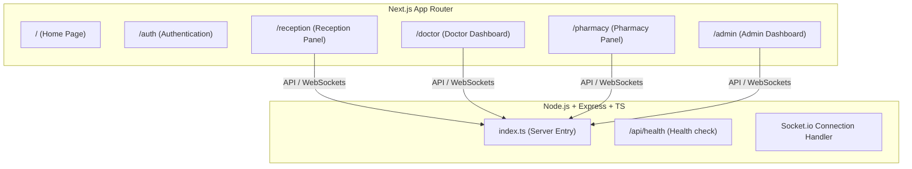

# Graph Report - MedflowX Initialization

This report tracks the components and code symbols added during the project initialization.

## System Graph Overview

```mermaid
graph TD
  subgraph Frontend [Next.js App Router]
    F_Home["/ (Home Page)"]
    F_Auth["/auth (Authentication)"]
    F_Reception["/reception (Reception Panel)"]
    F_Doctor["/doctor (Doctor Dashboard)"]
    F_Pharmacy["/pharmacy (Pharmacy Panel)"]
    F_Admin["/admin (Admin Dashboard)"]
  end

  subgraph Backend [Node.js + Express + TS]
    B_Server["index.ts (Server Entry)"]
    B_Health["/api/health (Health check)"]
    B_Socket["Socket.io Connection Handler"]
  end

  F_Reception -->|API / WebSockets| B_Server
  F_Doctor -->|API / WebSockets| B_Server
  F_Pharmacy -->|API / WebSockets| B_Server
  F_Admin -->|API / WebSockets| B_Server
```

## Initialized Folders & Files

### Frontend
- `/frontend`
  - `/src/app/layout.tsx` - Root layout
  - `/src/app/page.tsx` - App home page
  - `/src/app/globals.css` - Global CSS with Tailwind CSS v4 directives
  - `/src/app/auth/page.tsx` - Auth module placeholder
  - `/src/app/reception/page.tsx` - Reception module placeholder
  - `/src/app/doctor/page.tsx` - Doctor module placeholder
  - `/src/app/pharmacy/page.tsx` - Completed Pharmacist Workspace UI (queue lookup, checkout, stock controls, socket connection)
  - `/src/app/admin/page.tsx` - Admin module placeholder

### Backend
- `/backend`
  - `/src/index.ts` - Setup Express, Socket.io, middleware, health check, and registered pharmacy routes
  - `/src/supabase.ts` - Supabase service role client connection helper
  - `/src/routes/pharmacy.ts` - Pharmacy business logic and endpoints (inventory, stock batch add, queue query, checkout FIFO logic)
  - `/package.json` - Backend dependency configuration
  - `/tsconfig.json` - Backend TypeScript compiler options
  - `/.env` - Backend environment settings

## Recent Fixes & Adjustments
- **Supabase Client Initialization**: Safe guards added in [supabaseClient.ts](file:///c:/Users/phani/Desktop/office-files/medical-tracker-trueupmedia/frontend/src/lib/supabaseClient.ts) to check configurations before calling `createClient`, preventing top-level crashes when environment variables are unset.
- **Supabase Null Client Fix**: Added Proxy-based safeguards in [supabaseClient.ts](file:///c:/Users/phani/Desktop/office-files/medical-tracker-trueupmedia/frontend/src/lib/supabaseClient.ts) and [supabase.ts](file:///c:/Users/phani/Desktop/office-files/medical-tracker-trueupmedia/frontend/src/lib/supabase.ts) to throw descriptive errors when Supabase environment variables are missing. This allows the reception panel's error boundary to display database connection instructions instead of throwing a blank screen with `Cannot read properties of null (reading 'from')`.
- **Frontend Environment Configuration**: Created a `.env.local` file in the `frontend` folder containing the correct Supabase connection parameters mapped from the backend environment configuration to establish database connectivity.
- **Outpatient Visit Query Nesting Fix**: Corrected relationship joining queries in [reception.ts](file:///c:/Users/phani/Desktop/office-files/medical-tracker-trueupmedia/frontend/src/services/reception.ts) where `departments(*)` was queried as a top-level property of `visits` or nested directly within `visits`. Because the database schema defines the department relation on the `doctors` table and not `visits`, `departments(*)` was nested inside `doctors(...)` select sub-queries to prevent Supabase from returning null results.
- **Push to Pharmacy Flow**: Replaced the "Complete & Print Rx" button and its print modal in [workspace-view.tsx](file:///c:/Users/phani/Desktop/office-files/medical-tracker-trueupmedia/frontend/src/features/doctor/workspace-view.tsx) with a "Push to Pharmacy" action. Clicking this updates the visit status to `'Sent to Pharmacy'` to queue it for the pharmacist, alerts the pharmacy panel in real-time via Socket.io, and successfully completes the consultation workspace flow without displaying a print window.
- **Visits and Departments Relationship Fix**: Resolved the Supabase `Could not find a relationship between 'visits' and 'departments' in the schema cache` error in [reception.ts](file:///c:/Users/phani/Desktop/office-files/medical-tracker-trueupmedia/frontend/src/services/reception.ts) by nesting the `departments` select parameter under the `doctors` sub-query. Additionally, updated the department display bindings in [patient-profile-view.tsx](file:///c:/Users/phani/Desktop/office-files/medical-tracker-trueupmedia/frontend/src/features/reception/patients/patient-profile-view.tsx) and [billing-invoices-list.tsx](file:///c:/Users/phani/Desktop/office-files/medical-tracker-trueupmedia/frontend/src/features/reception/payments/billing-invoices-list.tsx) to safely access the department name through the doctor relationship.
- **Admin & Receptionist Fetch Error / Supabase Suffix Fix**: Resolved `TypeError: Failed to fetch` errors in both the admin and receptionist panels. This was done by sanitizing `NEXT_PUBLIC_SUPABASE_URL` in [supabase.ts](file:///c:/Users/phani/Desktop/office-files/medical-tracker-trueupmedia/frontend/src/lib/supabase.ts) to strip trailing `/rest/v1` or `/rest/v1/` path suffixes and overwriting [supabaseClient.ts](file:///c:/Users/phani/Desktop/office-files/medical-tracker-trueupmedia/frontend/src/lib/supabaseClient.ts) to re-export the unified client instance from [supabase.ts](file:///c:/Users/phani/Desktop/office-files/medical-tracker-trueupmedia/frontend/src/lib/supabase.ts). This ensures consistency and prevents duplicate initialization errors across all dashboards.
- **Login Role Selection Limitation**: Hid the doctor and pharmacist panels from the login selection options by removing the respective configurations from `ROLES` in [page.tsx](file:///c:/Users/phani/Desktop/office-files/medical-tracker-trueupmedia/frontend/src/app/auth/page.tsx). This ensures only receptionist and admin users can select a workspace and sign in from the authentication page.
- **First Visit Costs / Subsequent Visits Free**: Implemented a check using the new `checkIsFirstVisit` in [reception.ts](file:///c:/Users/phani/Desktop/office-files/medical-tracker-trueupmedia/frontend/src/services/reception.ts) to verify if the patient has any previous visits in the database. If they have visited before, the visit creation logic sets the invoice amount to ₹0. Additionally, updated [visit-wizard-view.tsx](file:///c:/Users/phani/Desktop/office-files/medical-tracker-trueupmedia/frontend/src/features/reception/visits/visit-wizard-view.tsx) to query and display the updated dynamic fee (₹0 for repeat visits) in the OPD Summary, passing the actual invoice final amount to the callbacks. Also adjusted [payment-collection-view.tsx](file:///c:/Users/phani/Desktop/office-files/medical-tracker-trueupmedia/frontend/src/features/reception/payments/payment-collection-view.tsx) to handle zero-fee transactions seamlessly without requiring transaction reference IDs, and to render user-friendly "Confirm Free Visit" labels.
- **Login Autofill Removal**: Removed default autofilled state values for username (email) and password inputs, disabled default email pre-filling during role selection, and added autocomplete-prevention attributes (`autoComplete="off"` and `autoComplete="new-password"`) to the authentication form and input fields in [page.tsx](file:///c:/Users/phani/Desktop/office-files/medical-tracker-trueupmedia/frontend/src/app/auth/page.tsx).
