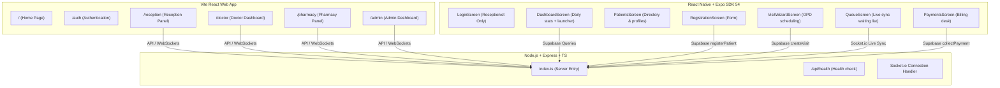

# Graph Report - MedflowX Initialization & Mobile Client

This report tracks the components, architecture, and code symbols added during the project initialization and mobile development phase.

## System Graph Overview

```mermaid
graph TD
  subgraph Frontend [Vite React Web App]
    F_Home["/ (Home Page)"]
    F_Auth["/auth (Authentication)"]
    F_Reception["/reception (Reception Panel)"]
    F_Doctor["/doctor (Doctor Dashboard)"]
    F_Pharmacy["/pharmacy (Pharmacy Panel)"]
    F_Admin["/admin (Admin Dashboard)"]
  end

  subgraph Mobile [React Native + Expo SDK 54]
    M_Auth["LoginScreen (Receptionist Only)"]
    M_Dash["DashboardScreen (Daily stats + launcher)"]
    M_Patients["PatientsScreen (Directory & profiles)"]
    M_Reg["RegistrationScreen (Form)"]
    M_Visit["VisitWizardScreen (OPD scheduling)"]
    M_Queue["QueueScreen (Live sync waiting list)"]
    M_Pay["PaymentsScreen (Billing desk)"]
  end

  subgraph Backend [Node.js + Express + TS]
    B_Server["index.ts (Server Entry)"]
    B_Health["/api/health (Health check)"]
    B_Socket["Socket.io Connection Handler"]
  end

  F_Reception -->|API / WebSockets| B_Server
  F_Doctor -->|API / WebSockets| B_Server
  F_Pharmacy -->|API / WebSockets| B_Server
  F_Admin -->|API / WebSockets| B_Server
  
  M_Dash -->|Supabase Queries| B_Server
  M_Reg -->|Supabase registerPatient| B_Server
  M_Visit -->|Supabase createVisit| B_Server
  M_Queue -->|Socket.io Live Sync| B_Server
  M_Pay -->|Supabase collectPayment| B_Server
```

## Initialized Folders & Files

### Frontend
- `/frontend`
  - `/src/app/layout.tsx` - Root layout
  - `/src/app/page.tsx` - App home page
  - `/src/app/globals.css` - Global CSS with Tailwind CSS v4 directives
  - `/src/app/auth/page.tsx` - Auth module placeholder
  - `/src/app/reception/page.tsx` - Reception module placeholder
  - `/src/app/doctor/page.tsx` - Doctor module placeholder
  - `/src/app/pharmacy/page.tsx` - Completed Pharmacist Workspace UI (queue lookup, checkout, stock controls, socket connection)
  - `/src/app/admin/page.tsx` - Admin module placeholder

### Mobile Client (Receptionist Only)
- `/mobile`
  - `/App.tsx` - Root coordinator for bottom-tab navigation and screens
  - `/app.json` - Expo project configuration for SDK 54.0.8 compatibility
  - `/package.json` - React Native 0.81.0, React 19.1.0, and required packages
  - `/src/config/supabase.ts` - Supabase client setup with AsyncStorage session persistence
  - `/src/config/socket.ts` - Real-time Socket.io client configuration
  - `/src/services/reception.ts` - Database transactions port for statistics, registrations, visits, and payments
  - `/src/theme/colors.ts` - Visual palette mirroring the web receptionist teal theme
  - `/src/components/UI.tsx` - Custom UI elements (themed Buttons, Inputs, Cards, and Badges)
  - `/src/screens/LoginScreen.tsx` - Role-restricted secure dark theme login
  - `/src/screens/DashboardScreen.tsx` - Daily metrics dashboard and launcher Hub
  - `/src/screens/PatientsScreen.tsx` - Outpatient directory and query database
  - `/src/screens/RegistrationScreen.tsx` - Outpatient registration forms
  - `/src/screens/ProfileScreen.tsx` - Outpatient profile sheet and visits logs
  - `/src/screens/VisitWizardScreen.tsx` - OPD scheduler with dynamic fee calculation
  - `/src/screens/QueueScreen.tsx` - Live queue with Socket.io auto-update
  - `/src/screens/PaymentsScreen.tsx` - Bill collector and invoice checkouts

### Backend
- `/backend`
  - `/src/index.ts` - Setup Express, Socket.io, middleware, health check, and registered pharmacy routes
  - `/src/supabase.ts` - Supabase service role client connection helper
  - `/src/routes/pharmacy.ts` - Pharmacy business logic and endpoints (inventory, stock batch add, queue query, checkout FIFO logic)
  - `/package.json` - Backend dependency configuration
  - `/tsconfig.json` - Backend TypeScript compiler options
  - `/.env` - Backend environment settings

## Recent Fixes & Adjustments
- **Receptionist Mobile Application Implementation**: Created a complete React Native mobile application under `/mobile` using Expo SDK 54. The mobile client targets receptionists exclusively, mirrors all web workflows with a premium teal theme styling, resolves environment parameters to host `https://medflowx.onrender.com`, and passes strict TypeScript compilation checks (`npx tsc --noEmit`) with zero errors.
- **Supabase Client Initialization**: Safe guards added in [supabaseClient.ts](file:///c:/Users/phani/Desktop/office-files/medical-tracker-trueupmedia/frontend/src/lib/supabaseClient.ts) to check configurations before calling `createClient`, preventing top-level crashes when environment variables are unset.
- **Supabase Null Client Fix**: Added Proxy-based safeguards in [supabaseClient.ts](file:///c:/Users/phani/Desktop/office-files/medical-tracker-trueupmedia/frontend/src/lib/supabaseClient.ts) and [supabase.ts](file:///c:/Users/phani/Desktop/office-files/medical-tracker-trueupmedia/frontend/src/lib/supabase.ts) to throw descriptive errors when Supabase environment variables are missing. This allows the reception panel's error boundary to display database connection instructions instead of throwing a blank screen with `Cannot read properties of null (reading 'from')`.
- **Frontend Environment Configuration**: Created a `.env.local` file in the `frontend` folder containing the correct Supabase connection parameters mapped from the backend environment configuration to establish database connectivity.
- **Outpatient Visit Query Nesting Fix**: Corrected relationship joining queries in [reception.ts](file:///c:/Users/phani/Desktop/office-files/medical-tracker-trueupmedia/frontend/src/services/reception.ts) where `departments(*)` was queried as a top-level property of `visits` or nested directly within `visits`. Because the database schema defines the department relation on the `doctors` table and not `visits`, `departments(*)` was nested inside `doctors(...)` select sub-queries to prevent Supabase from returning null results.
- **Push to Pharmacy Flow**: Replaced the "Complete & Print Rx" button and its print modal in [workspace-view.tsx](file:///c:/Users/phani/Desktop/office-files/medical-tracker-trueupmedia/frontend/src/features/doctor/workspace-view.tsx) with a "Push to Pharmacy" action. Clicking this updates the visit status to `'Sent to Pharmacy'` to queue it for the pharmacist, alerts the pharmacy panel in real-time via Socket.io, and successfully completes the consultation workspace flow without displaying a print window.
- **Visits and Departments Relationship Fix**: Resolved the Supabase `Could not find a relationship between 'visits' and 'departments' in the schema cache` error in [reception.ts](file:///c:/Users/phani/Desktop/office-files/medical-tracker-trueupmedia/frontend/src/services/reception.ts) by nesting the `departments` select parameter under the `doctors` sub-query. Additionally, updated the department display bindings in [patient-profile-view.tsx](file:///c:/Users/phani/Desktop/office-files/medical-tracker-trueupmedia/frontend/src/features/reception/patients/patient-profile-view.tsx) and [billing-invoices-list.tsx](file:///c:/Users/phani/Desktop/office-files/medical-tracker-trueupmedia/frontend/src/features/reception/payments/billing-invoices-list.tsx) to safely access the department name through the doctor relationship.
- **Admin & Receptionist Fetch Error / Supabase Suffix Fix**: Resolved `TypeError: Failed to fetch` errors in both the admin and receptionist panels. This was done by sanitizing `NEXT_PUBLIC_SUPABASE_URL` in [supabase.ts](file:///c:/Users/phani/Desktop/office-files/medical-tracker-trueupmedia/frontend/src/lib/supabase.ts) to strip trailing `/rest/v1` or `/rest/v1/` path suffixes and overwriting [supabaseClient.ts](file:///c:/Users/phani/Desktop/office-files/medical-tracker-trueupmedia/frontend/src/lib/supabaseClient.ts) to re-export the unified client instance from [supabase.ts](file:///c:/Users/phani/Desktop/office-files/medical-tracker-trueupmedia/frontend/src/lib/supabase.ts). This ensures consistency and prevents duplicate initialization errors across all dashboards.
- **Login Role Selection Limitation**: Hid the doctor and pharmacist panels from the login selection options by removing the respective configurations from `ROLES` in [page.tsx](file:///c:/Users/phani/Desktop/office-files/medical-tracker-trueupmedia/frontend/src/app/auth/page.tsx). This ensures only receptionist and admin users can select a workspace and sign in from the authentication page.
- **First Visit Costs / Subsequent Visits Free**: Implemented a check using the new `checkIsFirstVisit` in [reception.ts](file:///c:/Users/phani/Desktop/office-files/medical-tracker-trueupmedia/frontend/src/services/reception.ts) to verify if the patient has any previous visits in the database. If they have visited before, the visit creation logic sets the invoice amount to ₹0. Additionally, updated [visit-wizard-view.tsx](file:///c:/Users/phani/Desktop/office-files/medical-tracker-trueupmedia/frontend/src/features/reception/visits/visit-wizard-view.tsx) to query and display the updated dynamic fee (₹0 for repeat visits) in the OPD Summary, passing the actual invoice final amount to the callbacks. Also adjusted [payment-collection-view.tsx](file:///c:/Users/phani/Desktop/office-files/medical-tracker-trueupmedia/frontend/src/features/reception/payments/payment-collection-view.tsx) to handle zero-fee transactions seamlessly without requiring transaction reference IDs, and to render user-friendly "Confirm Free Visit" labels.
- **Login Autofill Removal**: Removed default autofilled state values for username (email) and password inputs, disabled default email pre-filling during role selection, and added autocomplete-prevention attributes (`autoComplete="off"` and `autoComplete="new-password"`) to the authentication form and input fields in [page.tsx](file:///c:/Users/phani/Desktop/office-files/medical-tracker-trueupmedia/frontend/src/app/auth/page.tsx).
- **Web Receptionist Intake Form Simplification**: Streamlined the patient intake forms in the Web Reception Panel ([registration-form-view.tsx](file:///c:/Users/phani/Desktop/office-files/medical-tracker-trueupmedia/frontend/src/features/reception/patients/registration-form-view.tsx), [schemas.ts](file:///c:/Users/phani/Desktop/office-files/medical-tracker-trueupmedia/frontend/src/features/reception/schemas.ts)). Removed unnecessary cluttered input fields (medical history, street address lines, pincode, district, email, emergency contact, occupation, blood group) and focused the UI on essential intake details (Full Name, Gender, Age/DOB, Contact Phone, Village/Town, State). Added database payload fallback defaults (`address_line` fallback to `city`, `pincode` fallback to `'000000'`) in the web service adapter ([reception.ts](file:///c:/Users/phani/Desktop/office-files/medical-tracker-trueupmedia/frontend/src/services/reception.ts)) to guarantee full backward database compatibility.
- **Doctor and Pharmacist Login Restoration & Protected Route Security Guards**:
  - **Login Page**: Re-added **Doctor** and **Pharmacist** workspace options into `ROLES` in [page.tsx](file:///c:/Users/phani/Desktop/office-files/medical-tracker-trueupmedia/frontend/src/app/auth/page.tsx). Users can now select Administrator, Receptionist, Doctor, or Pharmacist directly from the workspace selector.
  - **URL Route Protection**: Implemented a `ProtectedRoute` component wrapper in [App.tsx](file:///c:/Users/phani/Desktop/office-files/medical-tracker-trueupmedia/frontend/src/App.tsx) for `/reception`, `/doctor`, `/pharmacy`, and `/admin`. Navigating directly to restricted URLs (e.g. `/reception` or `/doctor`) without active authentication or matching workspace roles automatically redirects the browser back to `/auth`.
  - **Page Auth Checks & Storage Cleanup**: Enhanced `useEffect` and `Logout` handlers across [reception/page.tsx](file:///c:/Users/phani/Desktop/office-files/medical-tracker-trueupmedia/frontend/src/app/reception/page.tsx), [doctor/page.tsx](file:///c:/Users/phani/Desktop/office-files/medical-tracker-trueupmedia/frontend/src/app/doctor/page.tsx), [pharmacy/page.tsx](file:///c:/Users/phani/Desktop/office-files/medical-tracker-trueupmedia/frontend/src/app/pharmacy/page.tsx), and [admin/page.tsx](file:///c:/Users/phani/Desktop/office-files/medical-tracker-trueupmedia/frontend/src/app/admin/page.tsx) to validate session storage on load and clear `medflowx_logged_in_user` upon logging out.
- **Pharmacy Page Duplicate `handleLogout` Declaration Fix**: Removed the duplicate `handleLogout` function declaration from [pharmacy/page.tsx](file:///c:/Users/phani/Desktop/office-files/medical-tracker-trueupmedia/frontend/src/app/pharmacy/page.tsx) to resolve Vite compilation error `Identifier 'handleLogout' has already been declared`.
- **Payments Foreign Key Violation Fix (`payments_invoice_id_fkey`)**: Fixed the `insert or update on table "payments" violates foreign key constraint "payments_invoice_id_fkey"` error. Updated `createVisit` in [reception.ts](file:///c:/Users/phani/Desktop/office-files/medical-tracker-trueupmedia/frontend/src/services/reception.ts) to automatically generate an `invoices` row upon visit creation, passed the newly created `invoice.id` in [visit-wizard-view.tsx](file:///c:/Users/phani/Desktop/office-files/medical-tracker-trueupmedia/frontend/src/features/reception/visits/visit-wizard-view.tsx), and added an `invoice_id` lookup/creation fallback safeguard to `collectPayment` in both web [reception.ts](file:///c:/Users/phani/Desktop/office-files/medical-tracker-trueupmedia/frontend/src/services/reception.ts) and mobile [reception.ts](file:///c:/Users/phani/Desktop/office-files/medical-tracker-trueupmedia/mobile/src/services/reception.ts).
- **Physical Prescription Enum Fix (`visit_status_type`)**: Fixed `invalid input value for enum visit_status_type: "Completed"` error when submitting physical prescriptions. Updated `submitPhysicalPrescription` in [reception.ts](file:///c:/Users/phani/Desktop/office-files/medical-tracker-trueupmedia/frontend/src/services/reception.ts) to update visit status to `'Prescribed'` (a valid Postgres enum value) instead of `'Completed'`, allowing database updates to succeed while maintaining correct status mapping across UI panels.
- **Prescription Image Display & Storage Resolution**:
  - **Storage Bucket Path Fix**: Corrected bucket path key in `uploadPrescriptionPhoto` in [reception.ts](file:///c:/Users/phani/Desktop/office-files/medical-tracker-trueupmedia/frontend/src/services/reception.ts) to upload directly to `fileName` instead of double-nested `prescriptions/${fileName}`.
  - **Dual Storage Persistence**: Enhanced `submitPhysicalPrescription` in [reception.ts](file:///c:/Users/phani/Desktop/office-files/medical-tracker-trueupmedia/frontend/src/services/reception.ts) to persist physical prescription image URLs & cost into the `prescriptions` table (using structured JSON payloads) as well as updating `visits` table columns.
  - **Robust Doctor Viewer**: Updated `loadPatientVisits` and rendering in [patients-view.tsx](file:///c:/Users/phani/Desktop/office-files/medical-tracker-trueupmedia/frontend/src/features/doctor/patients-view.tsx) with a dual parser (inspecting both `visits` columns and joined `prescriptions` records) so physical prescription photos and costs display reliably in the Doctor Panel under any database state.

